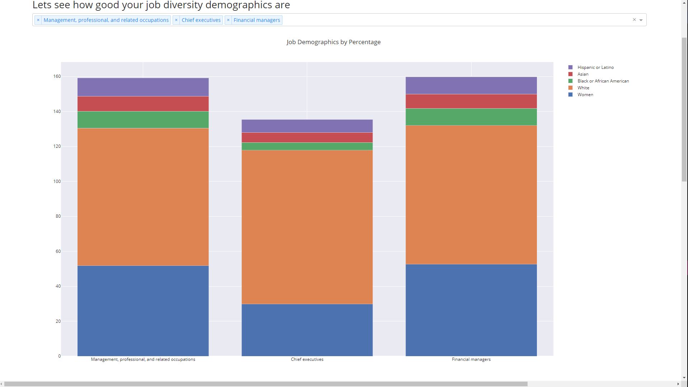

# Hackon-Hackathon-May-2021
Resources and Code for our entry to the HackOn Hackathon May 2021 competition!

Contributors: Shlok, Saurabh, and Corey

Tracking Progress, Project Board:
https://github.com/users/CoreyWarren/projects/1

PRESENTATION:
https://www.youtube.com/watch?v=nGowhizYK9M

### './code'
Where all of the code is. The app is all included in "./code/controller/...".
### './data'
Various old CSV files which actually are no longer relevant to the app shipped during the Hackathon.
### './official-help'
Some official documentation from the hackathon. (not ours)
### './team-notes'
Notes, drawings, and images shared between the team. (Not all, most were shared on Discord)

## Q: Which file do I run?
Run './code/controller/DiversityController.py' with Python.

## Q: What dependences does the main file have?
The file utilizes these other files:

'./code/controller/RecordKeeper.py'

'./code/controller/diversity_persistance.csv'

### You may also need to pip install these libraries:

#### Dash, dash_core_components, pandas, plotly

## Q: Where is your submission documentation?
https://docs.google.com/document/d/1MGS84qhfHjLUTp2XoSV5UMIemFcRQiRA1_pS49b6JRI/edit

## Q: How long was the hackathon?
48 hours, May 27 2021 to May 29 2021, with respect to PST.

## Q: What technologies were used?
Python, Dash, HTML, CSS, Plotly

